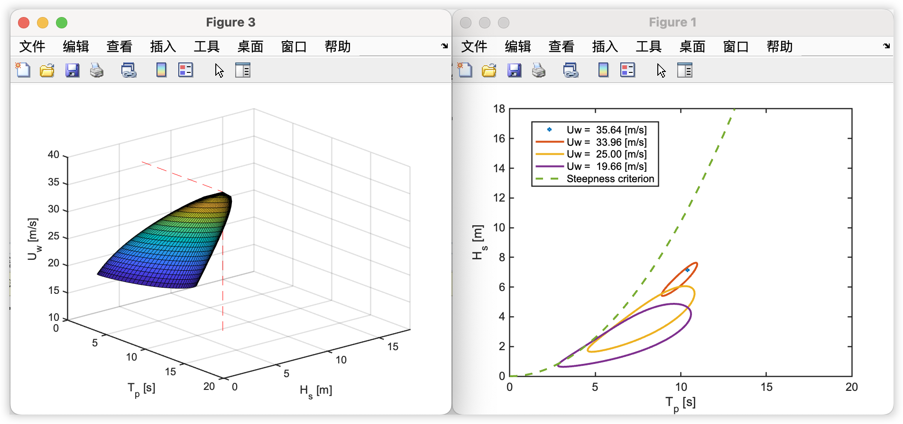

# 20240117讨论

## 文档信息

- 作者：水伊迪
- 创建日期：2024年1月17日
- 联系方式：<shuiyiudi@sjtu.edu.cn>

## 数据建模的方法

建模过程中使用到的方法与具体细节被整理到了这个文档：[数据建模的方法](./assets/methodology.md)。

## 已有成果

- 由原始环境数据获得文档`数据建模的方法`中所有参数拟合结果的`python`代码。
- 实现最终建模结果的代码，一个例子的效果如下图所示：

- 整个任务流程的工作内容被整理到了这个文档：[全任务流程记录](./assets/READMe.md)。

## 拟合结果与讨论

### 风速的概率密度函数

环境原始数据中的风速直方图以及Weibull拟合的结果如下图所示，环境数据中的最高风速达到37m/s左右，在拟合的时候是否需要考虑极端情况的影响？

### 有义波高的条件概率密度函数

将风速分为若干个区间，分别在每个子区间内对有义波高进行拟合，获得不同风速下的形状参数和尺度参数，但是风速较高的几组拟合数据较少，效果也并不好，是否需要保留？效果如下图所示：

对于不同风速组的形状参数和尺度参数，拟合效果如下图所示：

### 主导周期的条件概率密度函数

#### $\bar{t}(h)$和$\bar{u}(h)$的拟合

将风速、有义波高分为若干个区间，分别在每个子区间内对主导周期进行拟合，论文 [1-Long-term joint distribution of environmental conditions in a.pdf](./assets/assets/1-Long-term%20joint%20distribution%20of%20environmental%20conditions%20in%20a.pdf)此部分提到：
> It should be noted that the wind-waveclasses with limited data are excluded to avoid large uncertainties. (19面最下面)

各个$H_s$区间内的数据结果如下表所示：

| Hs (m) （区间中点） | 数据个数 |
|--------|----------|
| 0.1    | 5814     |
| 0.3    | 50879    |
| 0.5    | 51361    |
| 0.7    | 44373    |
| 0.9    | 37601    |
| 1.1    | 28534    |
| 1.3    | 18593    |
| 1.5    | 10698    |
| 1.7    | 7382     |
| 1.9    | 4934     |
| 2.1    | 3663     |
| 2.3    | 2771     |
| 2.5    | 1709     |
| 2.7    | 1088     |
| 2.9    | 755      |
| 3.1    | 516      |
| 3.3    | 297      |
| 3.5    | 227      |
| 3.7    | 122      |
| 3.9    | 86       |
| 4.1    | 84       |
| 4.3    | 64       |
| 4.5    | 41       |
| 4.7    | 34       |
| 4.9    | 25       |
| 5.1    | 23       |
| 5.3    | 23       |
| 5.5    | 12       |
| 5.7    | 10       |
| 5.9    | 10       |
| 6.1    | 8        |
| 6.3    | 8        |
| 6.7    | 4        |
| 6.9    | 1        |
| 7.1    | 2        |

分别只考虑$0<H_s<3$和$0<H_s<7.2$的情况，$\bar{t}(h)$和$\bar{u}(h)$拟合结果如下图所示：

两种情况下对应的参数拟合结果如下表所示：

| 条件 | 参数    | c1                  | c2                 | c3                  |
|------|---------|---------------------|--------------------|---------------------|
| 0<Hs<3 | bar_Tp  | 2.7330854646693687  | 0.65041409737329  | 2.4828266991341694 |
| 0<Hs<3 | bar_Uw  | 12.31736643657217   | 0.4375958080580295 | -3.3226063779607444|
| 0<Hs<7.2   | bar_Tp  | 4.301256484334087   | 0.40843936001301934| 1.1041430378299202 |
| 0<Hs<7.2  | bar_Uw  | 7.190408751613842   | 0.7110204922450671 | 1.1810537051439585 |

在拟合的时候，是否需要用到全部$H_s$数据？

> 马师姐的观点：我的感觉是都要拟合，那些极端风浪也很重要，毕竟在工程上是要考虑极端工况的。假设老师论文的$H_s$大部分集中在2m以下，但在17个月的监测数据里，还出现一次7.13m，那么这个点就没办法确认它的重现期是一年一次？两年一次？还是更大的，比如50年出现一次，所以这种点去除比较合适。

#### $\theta(h)$和$\gamma$的拟合

同论文中的处理方法一致，将$\gamma$选为1，采用线性拟合，部分效果见下图：

同论文中的处理方法一致，最终采用求平均值的方法确定$\vartheta$，效果如下图所示，请问是否可以这样处理？

#### $\nu$的拟合

这里同样只选取了$0<H_s<3$的数据进行拟合，结果如下图所示：

这里拟合的参数结果数值有一些奇怪，但是确实能用。

| 参数 | 值                      |
|------|-------------------------|
| f1   | -1236.068720779557      |
| f2   | 7.156848645575398e-05   |
| f3   | 1236.1961412373694      |

### 如何验收及检验结果的正确性

如小节标题所言。
