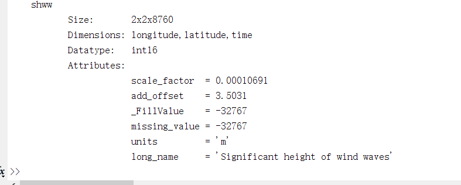
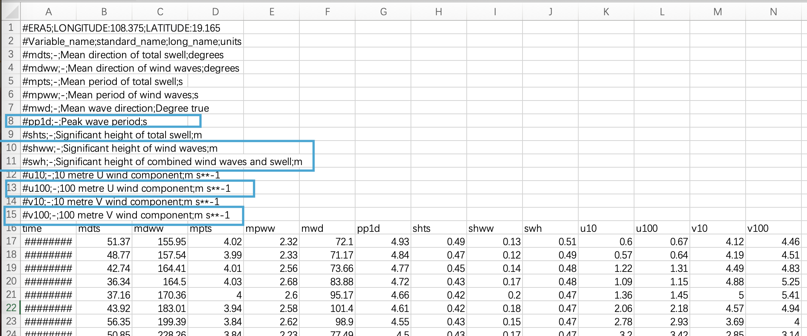
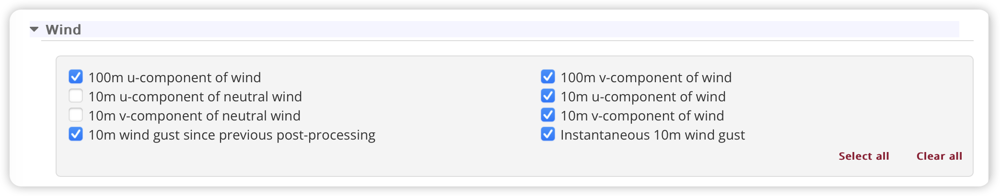
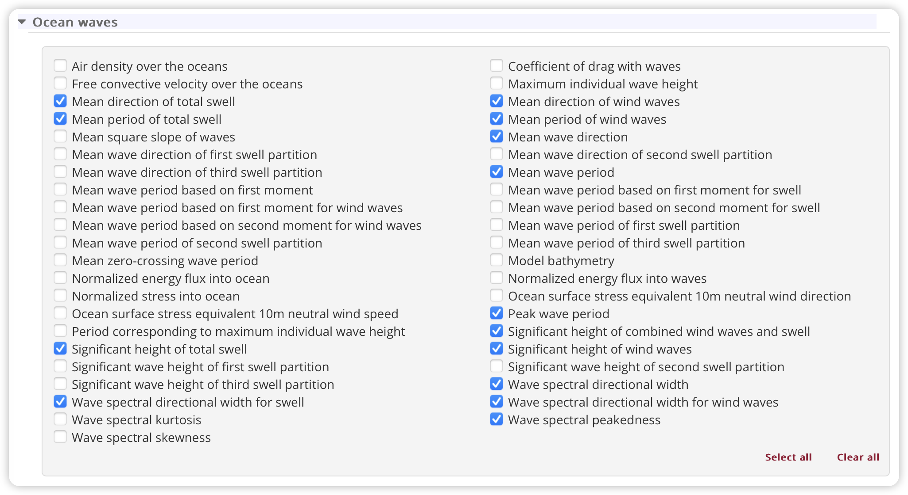
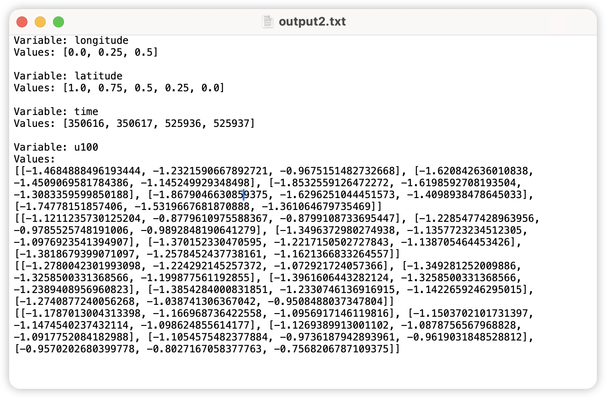
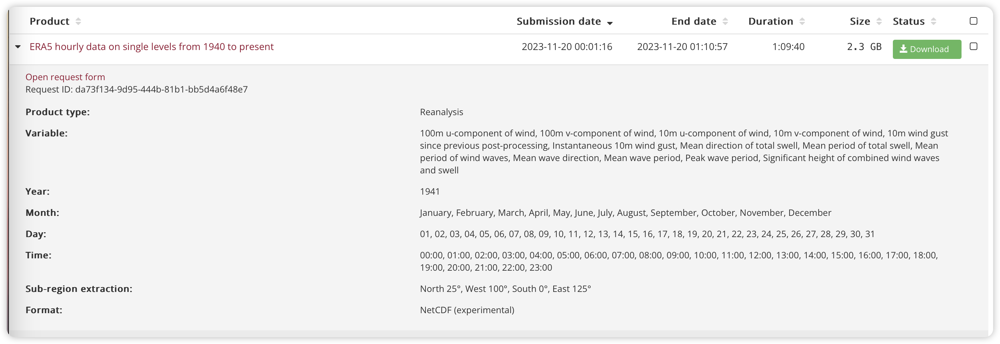
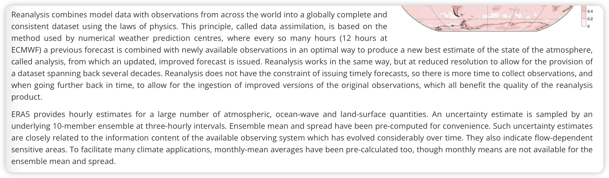
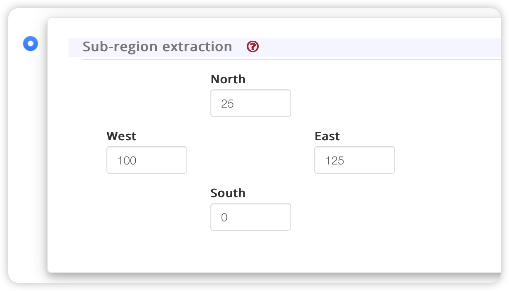
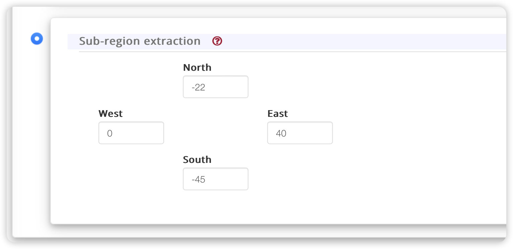

# 数据收集

## 文档信息

- 作者：水伊迪
- 创建日期：2023年11月19日
- 联系方式：<shuiyiudi@sjtu.edu.cn>

## 工作说明

### 程正顺老师

> 我们的科技部国合项目需要开始做些工作了，第一部分是海洋环境建模，需要做些资料收集和建模的工作。
>
> 这部分工作请水伊迪你来完成一下，中国南海和南非近海海洋环境资料的收集你请教一下李沈杰，我们关心的是$h_s$, $t_p$以及$u$的联合分布。
>>$h_s$（有时也写作 $H_s$）：代表显著波高（Significant Wave Height）。显著波高是波浪谱中的一个统计量，表示在一定时间和空间范围内波浪的平均波高。它是一种平均测量，用于描述波浪场中波高的大小。显著波高通常是在一定时间范围内，例如一个小时内的平均波高。
>>
>>$t_p$：代表主导周期（Peak Period），也称为主波周期。主导周期是波浪谱中波能最集中的周期，即谱中波浪能量最大的波的周期。这是一个描述波浪间隔的参数，可以帮助理解波浪的频率特性。
>>
>> $u$：这里提到的$u$是风场的水平速度。
>
> 相关工作之前马悦源做过部分，悦源你来指导一下。
>
> 这个工作不急，可以到年底，12月底。

### 李沈杰师兄

> 水师弟这个是我搜集海洋环境数据的网站，
> <https://cds.climate.copernicus.eu/cdsapp#!/dataset/reanalysis-era5-single-levels?tab=form>
>
> 可以在这个界面选择想要下载的数据类型，日期和经纬度。一般我都是下载nc类型的文件，用matlab的`ncdisp`和`ncread`函数可以处理nc类型的文件。
>
> 我在压缩包里放了一个例子，先用ncdisp展示参数的名称，再用ncread就可以对相应的参数进行赋值和处理。
>
> 

### 最终描述

我们关心的是$h_s$, $t_p$以及$u$（100m处的风速）的联合分布，即对应论文中的第11个公式，我们最终要得到的结果是论文中的图22。按照下图的命名原则，需要用$u$（朝东方向的风）和$v$（朝北方向的风）两个方向的合成风速来进行建模，即$U_w = \sqrt{u^2 + v^2}$；有义波高选用`swh`变量，主导周期选用`pp1d`变量。



> 你把这篇论文看了，基本就差不多了
> [Long-term joint distribution of environmental conditions in a Norwegian fjord for design of floating bridges](./assets/1-Long-term%20joint%20distribution%20of%20environmental%20conditions%20in%20a.pdf)


## 工作进展

### 2023-11-19

经过和马悦源师姐以及老师的讨论，确定了要收集哪些数据（共20个变量）：

> peak wave period, significant height of wind wave/swell/combined, wave spectral direction width，wave spectral peakedness
>
> wave spectral direction width for wind wave/swell
>
> mean direction和mean wave period也加上，包括总的和分开wind wave/swell的
>
> 10m u-component of wind, 10m v-component of wind, 10m wind gust since previous post processing, instantaneous 10m wind gust




马悦源师姐提供的数据处理方法：
> 你把这篇论文看了，基本就差不多了
> [Long-term joint distribution of environmental conditions in a Norwegian fjord for design of floating bridges](./assets/1-Long-term%20joint%20distribution%20of%20environmental%20conditions%20in%20a.pdf)

利用`python`将`nc`数据格式转换为`txt`格式的方法：

```python
import netCDF4 as nc

# 打开NetCDF文件以进行读取
nc_file = nc.Dataset(
    "nc-filename",
    "r",
)

# 指定要写入的文本文件名
text_file_name = "output2.txt"

# 打开文本文件以进行写入
with open(text_file_name, "w") as text_file:
    # 遍历NetCDF文件中的变量
    for var_name, var in nc_file.variables.items():
        # 写入变量名
        text_file.write(f"Variable: {var_name}\n")

        # 如果变量是一维数组，直接写入数值
        if len(var.shape) == 1:
            text_file.write(f"Values: {var[:].tolist()}\n\n")
        else:
            # 如果变量是多维数组，逐行写入数值
            text_file.write("Values:\n")
            for row in var[:]:
                text_file.write(f"{row.tolist()}\n")
            text_file.write("\n")

# 关闭NetCDF文件
nc_file.close()
```

所获得数据的格式说明，以下图为例：

- **经纬度网格**：如例子所示，经纬度网格数据的行代表不同纬度，列代表不同经度，这跟地图上的效果是一致的。
- **时间**：每个二维数据对应一个时间点，时间是用一个序列来表示的，起始点是1940年1月1日0点，对应的数字为350616，每经过一个小时数字加一，可以通过下面的代码快速得到对应的日期：

```python
from datetime import datetime, timedelta

# 定义1940年1月1日零点的时间，对应的时间戳数字为350616
base_datetime = datetime(1940, 1, 1, 0, 0, 0)

time = input('请输入时间戳数字：')

# 将351367小时加到基准时间上
target_datetime = base_datetime + timedelta(hours=time - 350616)

print(f"{time}小时表示的日期和时间为:", target_datetime)
```



#### 疑问

- **网站所需要的数据生成时间**：下图以南海海域13个变量，一年内12个月每天每个小时的数据大小及生成所需时间见下图：



- **时间选项**：网站提供1940年以来每个小时的数据，需要下载的数据时间范围是多少？


> **程老师**：时间最好在20年以上，尽可能多。你通过我们的服务器，用服务器去下载，我们要的是每个小时的数值。

- **数据来源并非全部是实测值**：全球的数据是通过模型+部分实测得到，这样是否可以使用？数据库的官方说明如下：



> **程老师**：数据是由观测值和预测值组成的，可以使用。

### 2023-11-21

#### 经纬度范围

南海的经纬度范围大约是：东经105°E至118°E，北纬4°N至23°37′，下图是我选用的经纬度范围：

{width=70%}

南非近海的经纬度范围大约是：东经10°E至35°E，南纬25°S至40°S，下图是我选用的经纬度范围：

{width=70%}

#### 服务器挂机脚本

##### 账号信息

我采用网站提供的API，利用三个不同的账号来下载数据：

1. **账号**：shuiyidi\@hust.edu.cn，**密码**：mygkuw-wepTub-qegzy0。API：

    ```bash
    url: https://cds.climate.copernicus.eu/api/v2
    key: 268652:da87779d-1ade-4d3c-8b2d-370740cf31d2
    ```

    此账号用来下载以下六个变量的数据：`100m u-component of wind, 100m v-component of wind`, `10m u-component of wind`, `10m v-component of wind`, `10m wind gust since previous post-processing`, `Instantaneous 10m wind gust`
2. **账号**：shuiyidi\@sjtu.edu.cn，**密码**：wewzav-giqzu2-keBpuz。API：

    ```bash
    url: https://cds.climate.copernicus.eu/api/v2
    key: 268420:aa7a087a-d782-495f-b9ae-39be3cda7e47
    ```

    此账号用来下载以下六个变量的数据：`Mean direction of total swell`, `Mean direction of wind waves`, `Mean period of total swell`, `Mean period of wind waves`, `Mean wave direction`, `Mean wave period`
3. **账号**：zdhshuiyidi\@foxmail.com，**密码**：DjrmCscZCMd7MyF。API：

   ```bash
    url: https://cds.climate.copernicus.eu/api/v2
    key: 268697:12513836-3055-4053-8198-c6785946c152
    ```

   此账号用来下载以下八个变量的数据：`Peak wave period`, `Significant height of combined wind waves and swell`, `Significant height of total swell`, `Significant height of wind waves`, `Wave spectral directional width`, `Wave spectral directional width for swell`, `Wave spectral directional width for wind waves`, `Wave spectral peakedness`

##### 脚本

账号：shuiyidi\@hust.edu.cn，转换完一轮数据大概需要30～42min。

```python
import cdsapi
import os
import logging

# 定义要写入文件的两行代码
api_line1 = "url: https://cds.climate.copernicus.eu/api/v2"
api_line2 = "key: 268652:da87779d-1ade-4d3c-8b2d-370740cf31d2"

year = 2023

# 获取用户的主目录路径
user_profile = os.path.expanduser("~")
file_path = os.path.join(user_profile, ".cdsapirc")

# 创建日志文件
logging.basicConfig(filename='Part1_log.txt', level=logging.INFO, format='%(asctime)s - %(message)s')

while year > 1940:
    # 写入两行代码到文件中
    with open(file_path, "w") as file:
        file.write(api_line1 + "\n")
        file.write(api_line2 + "\n")

    # 创建cdsapi客户端
    c = cdsapi.Client()
    c.retrieve(
        'reanalysis-era5-single-levels',
        {
            'product_type': 'reanalysis',
            'format': 'netcdf',
            'variable': [
                '100m_u_component_of_wind', '100m_v_component_of_wind', '10m_u_component_of_wind',
                '10m_v_component_of_wind', '10m_wind_gust_since_previous_post_processing', 'instantaneous_10m_wind_gust',
            ],
            'year': f'{year}',
            'month': [
                '01', '02', '03',
                '04', '05', '06',
                '07', '08', '09',
                '10', '11', '12',
            ],
            'day': [
                '01', '02', '03',
                '04', '05', '06',
                '07', '08', '09',
                '10', '11', '12',
                '13', '14', '15',
                '16', '17', '18',
                '19', '20', '21',
                '22', '23', '24',
                '25', '26', '27',
                '28', '29', '30',
                '31',
            ],
            'time': [
                '00:00', '01:00', '02:00',
                '03:00', '04:00', '05:00',
                '06:00', '07:00', '08:00',
                '09:00', '10:00', '11:00',
                '12:00', '13:00', '14:00',
                '15:00', '16:00', '17:00',
                '18:00', '19:00', '20:00',
                '21:00', '22:00', '23:00',
            ],
            'area': [
                25, 100, 0,
                125,
            ],
        },
        f'part1_{year}_download.nc')
    logging.info(f"Part1 year {year} successfully processed.")

    year -= 1

```

账号：shuiyidi\@sjtu.edu.cn，转换完一轮数据大概需要18～25min。

```python
import cdsapi
import os
import logging

# 定义要写入文件的两行代码
api_line1 = "url: https://cds.climate.copernicus.eu/api/v2"
api_line2 = "key: 268420:aa7a087a-d782-495f-b9ae-39be3cda7e47"

year = 2023

# 获取用户的主目录路径
user_profile = os.path.expanduser("~")
file_path = os.path.join(user_profile, ".cdsapirc")

# 创建日志文件
logging.basicConfig(filename='Part2_log.txt', level=logging.INFO, format='%(asctime)s - %(message)s')

while year > 1940:
    # 写入两行代码到文件中
    with open(file_path, "w") as file:
        file.write(api_line1 + "\n")
        file.write(api_line2 + "\n")

    # 创建cdsapi客户端
    c = cdsapi.Client()
    c.retrieve(
    'reanalysis-era5-single-levels',
    {
        'product_type': 'reanalysis',
        'variable': [
            'mean_direction_of_total_swell', 'mean_direction_of_wind_waves', 'mean_period_of_total_swell',
            'mean_period_of_wind_waves', 'mean_wave_direction', 'mean_wave_period',
        ],
        'year': f'{year}',
        'month': [
            '01', '02', '03',
            '04', '05', '06',
            '07', '08', '09',
            '10', '11', '12',
        ],
        'day': [
            '01', '02', '03',
            '04', '05', '06',
            '07', '08', '09',
            '10', '11', '12',
            '13', '14', '15',
            '16', '17', '18',
            '19', '20', '21',
            '22', '23', '24',
            '25', '26', '27',
            '28', '29', '30',
            '31',
        ],
        'time': [
            '00:00', '01:00', '02:00',
            '03:00', '04:00', '05:00',
            '06:00', '07:00', '08:00',
            '09:00', '10:00', '11:00',
            '12:00', '13:00', '14:00',
            '15:00', '16:00', '17:00',
            '18:00', '19:00', '20:00',
            '21:00', '22:00', '23:00',
        ],
        'area': [
            25, 100, 0,
            125,
        ],
        'format': 'netcdf',
    },
    f'part2_{year}_download.nc')
    logging.info(f"Part2 year {year} successfully processed.")

    year -= 1
```

账号：zdhshuiyidi\@foxmail.com，转换完一轮数据大概需要27～35min。

```python
import cdsapi
import os
import logging

# 定义要写入文件的两行代码
api_line1 = "url: https://cds.climate.copernicus.eu/api/v2"
api_line2 = "key: 268697:12513836-3055-4053-8198-c6785946c152"

year = 2023

# 获取用户的主目录路径
user_profile = os.path.expanduser("~")
file_path = os.path.join(user_profile, ".cdsapirc")

# 创建日志文件
logging.basicConfig(filename='Part3_log.txt', level=logging.INFO, format='%(asctime)s - %(message)s')

while year > 1940:
    # 写入两行代码到文件中
    with open(file_path, "w") as file:
        file.write(api_line1 + "\n")
        file.write(api_line2 + "\n")

    # 创建cdsapi客户端
    c = cdsapi.Client()
    c.retrieve(
        'reanalysis-era5-single-levels',
        {
            'product_type': 'reanalysis',
            'variable': [
                'peak_wave_period', 'significant_height_of_combined_wind_waves_and_swell', 'significant_height_of_total_swell',
                'significant_height_of_wind_waves', 'wave_spectral_directional_width', 'wave_spectral_directional_width_for_swell',
                'wave_spectral_directional_width_for_wind_waves', 'wave_spectral_peakedness',
            ],
            'year': f'{year}',
            'month': [
                '01', '02', '03',
                '04', '05', '06',
                '07', '08', '09',
                '10', '11', '12',
            ],
            'day': [
                '01', '02', '03',
                '04', '05', '06',
                '07', '08', '09',
                '10', '11', '12',
                '13', '14', '15',
                '16', '17', '18',
                '19', '20', '21',
                '22', '23', '24',
                '25', '26', '27',
                '28', '29', '30',
                '31',
            ],
            'time': [
                '00:00', '01:00', '02:00',
                '03:00', '04:00', '05:00',
                '06:00', '07:00', '08:00',
                '09:00', '10:00', '11:00',
                '12:00', '13:00', '14:00',
                '15:00', '16:00', '17:00',
                '18:00', '19:00', '20:00',
                '21:00', '22:00', '23:00',
            ],
            'area': [
                25, 100, 0,
                125,
            ],
            'format': 'netcdf',
        },
        f'part3_{year}_download.nc') 
    logging.info(f"Part3 year {year} successfully processed.")

    year -= 1
```

##### 使用说明

分别运行`./download`下三个`part`文件夹中的`.ipynb`笔记本，即可开始向`cds`网站请求数据转换并进行下载，下载的数据以`part{x}_{year}_download.nc`的格式保存在对应文件夹下。

转换`.nc`数据为`.txt`文件的`python`代码见`./code_snippet.ipynb`笔记本。

**在使用本数据文件时，请仔细阅读该`README.md`文件，如果遇到出错，请首先查看对应文件夹下的日志文件**。

#### 运行

2023年11月21日下午14:27第一次同时运行这三个脚本。

### 2023-11-23

#### 运行情况

在4号服务器上下载数据，目前南海海域的`part2`部分已经下载完成，开始下载南非近海海域的`part2`部分，具体情况可以看`./download/.part{x}`下的日志文件。

### 2023-12-1

马悦源师姐给了我两个文件包：`myy_code`和`MatlabCode_BF`，第一个文件包，是她当时用的代码；第二个文件包，是老师当时给的相关计算代码，我要算的这两个压缩包里都有了。

那你先看论文吧，你把整个那个这个联合概率分布是怎么算的，怎么一步一步做的，先了解清楚，然后老师那个论文写的很好很清楚。如果你把那个看懂了，看完了。那你就直接去我给你那两个压缩包里面去找代码就好，因为代码几乎都是现成的，你可能自己仅仅需要简单的微调。

### 2023-12-3

#### 疑问

- **如何理解一部分公式、图片**：二维变量分布的拟合是什么意义？如何理解图14中每个$H_s$对应的纵轴？如何理解图15中raw data的来源？
- **可以在这些数据中，找水深100米左右**：什么意思？

### 2023-12-5

今天跟程老师上课的时候沟通了一下，我对要做什么更清楚了：

- **可以在这些数据中，找水深100米左右**：找到海南万宁近海100米水深处的经纬度数据，然后针对这部分数据进行分析。
- **之前提到的任务目标**：我们关心的是$h_s$, $t_p$以及$u$（100m处的风速）的联合分布，即对应论文中的第11个公式，我们最终要得到的结果是论文中的图22。按照下图的命名原则，需要用$u$（朝东方向的风）和$v$（朝北方向的风）两个方向的合成风速来进行建模，即$U_w = \sqrt{u^2 + v^2}$；有义波高选用`swh`变量，主导周期选用`pp1d`变量。


> 你把这篇论文看了，基本就差不多了
> [Long-term joint distribution of environmental conditions in a Norwegian fjord for design of floating bridges](./assets/1-Long-term%20joint%20distribution%20of%20environmental%20conditions%20in%20a.pdf)

### 2023-12-13

今天跟马悦源师姐开了个会议讨论，她发给我了两个之前的PPT，让我参考着试试，文件是`2021年3月4号.pptx`和`2021年4月20号.pptx`。

### 2023-12-19

把手头的综述写作完成后，准备同时开始海油项目数据分析以及本项目的数据建模。

### 2024-01-02

前段时间在弄海油项目两份报告以及跑工况出图的任务，然后复习水弹性课程，现在又在复习两门数学课，项目的进度一直没有推动。今天程老师发了我一封邮件：

> 伊迪
>
> 请阅读下面邮件，根据提供的资料把海洋环境数据下载一下。数据存在有效期的时间限制，请及时下载。
>
> 我们就以海南岛附近海域为研究对象，先建立该海域的联合概率密度分布，这部分工作以及报告撰写希望在1月中下旬完成，水伊迪处理数据撰写报告，马悦源你之前做过类似的工作，提供指导。
>
> 后面会与Gareth Erfort约时间，看他那边能否提供南非那边的环境数据，以期能够顺利完成南非项目的第一份报告。
>
> 祝好

我把邮件里面提到的数据以及脚本放到`data_from_cheng`文件夹中去了。

### 2024-01-11

考完试开始处理这项工作。1月2号邮件里面提到的那个脚本，是针对数据进行简单的统计处理工作，其官方文档链接为[metocean_stats.stats文档](https://metocean-stats.readthedocs.io/en/latest/)，据我观察跟我们建模需求不符。

### 2024-01-14

熟悉Git版本管理工具的使用，此次工作我将尝试通过Git来进行版本控制。

### 2024-01-15

最新部分的建模方法写在`./data_from_cheng/methodology.md`文件中。

### 2024-01-16

完成了前两部分概率密度函数的拟合，具体内容见`./data_from_cheng/methodology.md`文件，跟马悦源师姐讨论确定了第三部分概率密度函数的拟合方法，开始写第三部分的技术文档。
