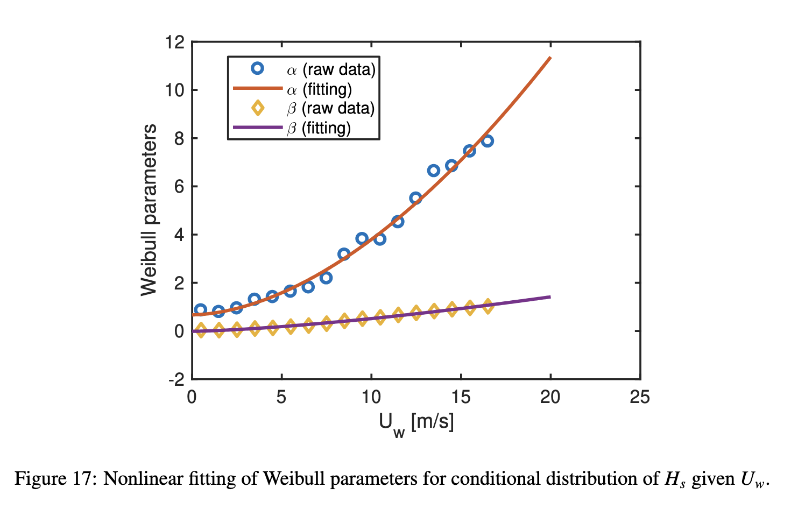
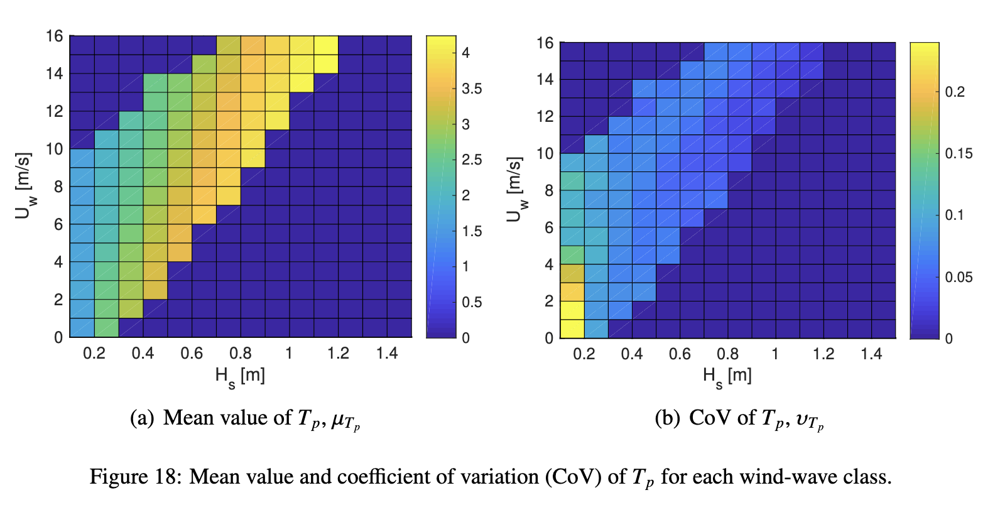
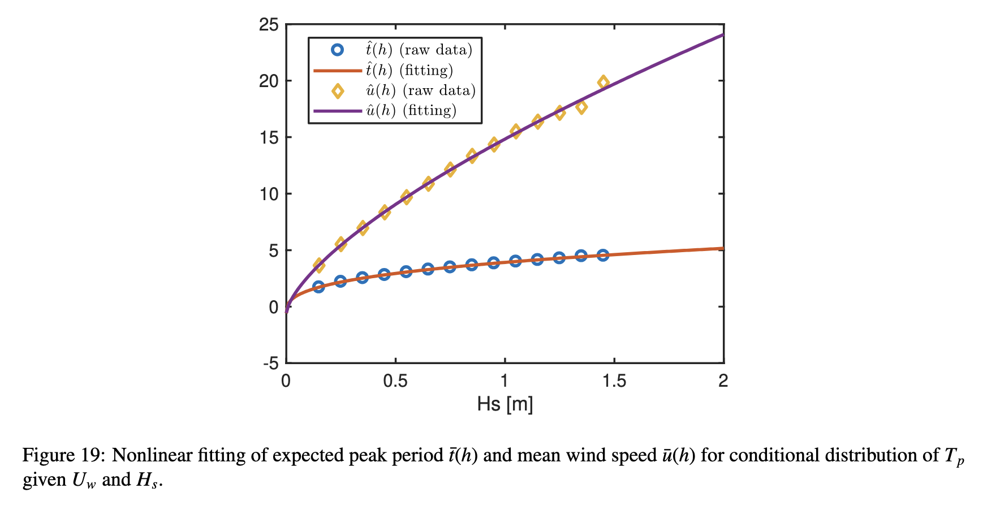
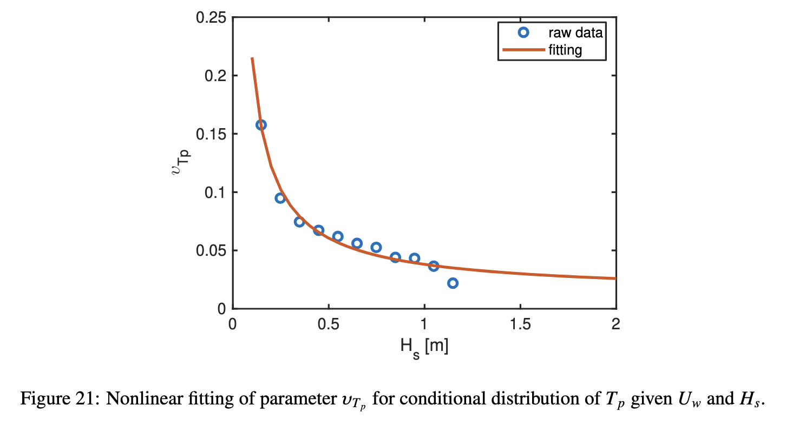

# 建模过程

## 文档信息

- 作者：水伊迪
- 创建日期：2024年1月15日
- 联系方式：<shuiyiudi@sjtu.edu.cn>

## 获得联合概率密度函数

总的目标是得到这个概率密度的结果，对应论文中的式11：
\[
    f_{U_w,H_s,T_p}(u,h,t)=f_{U_w}(u)f_{H_s|U_w}(h|u)f_{T_p|U_w,H_s}(t|u,h)
\]

### 风速U_w的概率密度函数

> 所使用的风速应该是$u$、$v$两个方向的合成风速，即$U_w=\sqrt{u^2+v^2}$

> 是否需要采用带loc的Weibull分布：<https://ww2.mathworks.cn/help/stats/three-parameter-weibull-distribution.html>？


采用Weibull分布模型，其概率密度函数为：
\[
    f_{U_w}(u)=\frac{\alpha_U}{\beta_U}\left(\frac u{\beta_U}\right)^{\alpha_U-1}\exp\left[-\left(\frac u{\beta_U}\right)^{\alpha_U}\right]
\]
其中，$\alpha_U$和$\beta_U$分别为形状参数和尺度参数，通过对全部风速数据进行拟合获得。

### 有义波高$H_s$的条件概率密度函数

采用Weibull分布模型，给定风速后其条件概率密度函数为：
\[
    f_{H_s|U_w}(h|u)=\frac{\alpha_{HC}}{\beta_{HC}}\left(\frac h{\beta_{HC}}\right)^{\alpha_{HC}-1}\exp\left[-\left(\frac h{\beta_{HC}}\right)^{\alpha_{HC}}\right]
\]
其中，$\alpha_{HC}$和$\beta_{HC}$分别为形状参数和尺度参数。

将风速分为若干个区间，分别在每个子区间内对有义波高进行拟合，获得不同风速下的形状参数和尺度参数，如下图所示：


按照下式对不同子区间内的形状参数和尺度参数进行拟合，效果如下图所示：

\[
    \begin{aligned}\alpha_{HC}&=a_1\cdot u^{a_2}+a_3 \\
    \beta_{HC}&=b_1\cdot u^{b_2}+b_3\end{aligned}
\]



这样就得到了任意给定风速下的条件概率密度函数$f_{H_s|U_w}(h|u)$。

### 周期$T_p$的条件概率密度函数

> 这一部分的拟合比较复杂，我会尽量写的清楚明白。

采用对数正态分布模型，给定风速和有义波高后其条件概率密度函数为：

\[
    f_{T_p|U_w,H_s}(t|u,h)=\frac1{\sqrt{2\pi}\sigma_{\ln(T_p)}t}\cdot\exp\left[-\frac12\left(\frac{\ln(t)-\mu_{\ln(T_p)}}{\sigma_{\ln(T_p)}}\right)^2\right]
\]

其中，$\mu_{\ln(T_p)}$和$\sigma_{\ln(T_p)}$是对数正态分布的两个参数，按照下面这些公式求得：

\[
    \begin{aligned}\mu_{\mathrm{ln}(T_p)}&=\ln\left(\frac{\mu_{T_p}}{\sqrt{1+\nu_{T_p}^2}}\right)\\
    \sigma_{\mathrm{ln}(T_p)}^2&=\ln\left(1+\nu_{T_p}^2\right)\\
    \upsilon_{T_p}&=\frac{\sigma_{T_p}}{\mu_{T_p}}\end{aligned}
\]

为了体现$T_p$依赖于风速和有义波高的关系，需要把$\mu_{T_p}$和$\upsilon_{T_p}$分别表示为风速和有义波高的函数。把给出的风速$U_w$和有义波高$H_s$分为若干个区间，下图展示了一个子区间划分的结果（类似棋盘形状），并且展示了这两个参数随风速和有义波高的变化情况。



根据上图可以看出这两个参数主要受$H_s$的影响，因此选择把它们表示为$H_s$的函数，如下式所示：

\[
    \mu_{T_p}=\bar{t}(u,h)=\bar{t}(h)\cdot\left[1+\vartheta\left(\frac{u-\bar{u}(h)}{\bar{u}(h)}\right)^\gamma\right]
\]

其中$\vartheta$和$\gamma$是拟合参数。$\bar{t}(h)$和$\bar{u}(h)$是某个给定$H_s$下的平均周期和平均风速，它们的计算方法如下：

- $\bar{t}(h)$是主导周期$T_p$关于有义波高$H_s$的函数，其含义及计算方法是：**对于每一个$H_s$子区间（即Figure18中每一列中的所有数据点），其区间中点值作为函数$\bar{t}(h)$自变量$h$的值，该区间内所有数据点主导周期$T_p$的平均值作为函数$\bar{t}(h)$的函数值。这样就可以得到若干个对应不同$h$的$\bar{t}(h)$值，接着用下面这个公式进行数据拟合：**

\[
    \bar{t}(h)=c_1\cdot h^{c_2}+c_3
\]

- $\bar{u}(h)$是风速$U_w$关于有义波高$H_s$的函数，其含义及计算方法是：**对于每一个$H_s$子区间（即Figure18中每一列中的所有数据点），其区间中点值作为函数$\bar{u}(h)$自变量$h$的值，该区间内所有数据点风速$U_w$的平均值作为函数$\bar{u}(h)$的函数值。这样就可以得到若干个对应不同$h$的$\bar{u}(h)$值，接着用下面这个公式进行数据拟合：**

\[
    \bar{u}(h)=d_1\cdot h^{d_2}+d_3
\]

其中$c_1,c_2,c_3,d_1,d_2,d_3$是拟合参数。

下图展示了一个拟合的结果，至此可以得到任意给定$H_s$下的平均周期$\bar{t}(h)$和平均风速$\bar{u}(h)$：



$\vartheta$和$\gamma$的拟合通过下式进行：

\[
    \frac{\bar{t}(u,h)-\bar{t}(h)}{\bar{t}(h)}=\vartheta\left(\frac{u-\bar{u}(h)}{\bar{u}(h)}\right)^\gamma
\]

通过上面的工作已经得到$\bar{t}(h)$和$\bar{u}(h)$，还需要计算$\bar{t}(u,h)$，其含义及计算方法是：**对于每一个$H_s、U_w$子区间（即Figure18中每一个小棋盘格），其区间$H_s、U_w$中点值作为函数$\bar{t}(u,h)$两个自变量的值，该区间内所有数据点主导周期$T_p$的平均值作为函数$\bar{t}(u,h)$的函数值。**

这样对于Figure18中的每一列（固定$H_s$）都可以得到对应不同$U_w$值的$\bar{t}(u,h)$值，划分了多少个$U_w$子区间，就有多少个数据点供这一步的拟合，可以得到一组$\vartheta$和$\gamma$的值。

> 该步确定好一列后，再对$U_w$进行区间划分时，只针对数据点中存在的风速区间进行划分，同样是用区间的中点值代表该棋盘格下的$U_w$值。

这样就可以得到Figure18中每一列对应的$\vartheta$和$\gamma$的值，论文中提到在大部分列划分$H_s$子区间内，$\gamma$都表现为1，所以直接取$\gamma=1$。$\vartheta$的拟合结果如下图所示，论文取$H_s$大于0.2的平均值$\vartheta=-0.25$，实际情况下可以选择合适的函数形式对$\vartheta$和$\gamma$进行拟合，并不一定严格按论文中的方法做。


关于自变量$h$的变异系数就是Figure18每一列算出来的变异系数，即：每一个$H_s$子区间中所有数据点的标准差除以均值，然后通过下式可以得到$\upsilon_{T_p}$的拟合：

> 这里完全是用原始数据算出的$\upsilon_{T_p}$，一个原则就是用原始数据来进行拟合的效果要比用拟合的数据来拟合准确，所以没有用到拟合出来的$\mu_{T_p}$来进行计算。

\[
    \upsilon_{T_p}(h)=f_1\cdot h^{f_2}+f_3
\]
其中$f_1,f_2,f_3$是拟合参数，下图展示了论文中拟合的效果：



这样就得到了任意给定风速和有义波高下的条件概率密度函数$f_{T_p|U_w,H_s}(t|u,h)$。

### 绘制环境轮廓表面图（environment contour surface）

> 注意Matlab中Weibull分布函数的参数顺序和Python中相反，Matlab中是scale在前，shape在后。

出图的`Matlab`代码如下：

```matlab{.line-numbers}
%  create the coutour surface for the DWR3
clear; clc; close all

load('JointPDfParam.mat')

figplotflag =0;

year = 50;
pf = 1/(365.25*24*year);
beta = norminv((1-pf),0,1);
%for i=1:1:
z=0.5:0.025:1;

u1=z*beta;
alpha_u=pdf_Uw.alpha*ones(1,length(u1));
beta_u=pdf_Uw.beta*ones(1,length(u1));
u=wblinv(normcdf(u1,0,1),alpha_u,beta_u);    % wind speed at 10 m height
angle = (0:pi/50:2*pi)';

% conditional distribution of Hs given Uw - Weibull distribution
a1 = pdf_HsUw.alpha(1);
a2 = pdf_HsUw.alpha(2);
a3 = pdf_HsUw.alpha(3);
b1 = pdf_HsUw.beta(1);
b2 = pdf_HsUw.beta(2);
b3 = pdf_HsUw.beta(3);

%  B
e1 = pdf_TpHsUw.t_bar(1);
e2 = pdf_TpHsUw.t_bar(2);
e3 = pdf_TpHsUw.t_bar(3);
f1 = pdf_TpHsUw.u_bar(1);
f2 = pdf_TpHsUw.u_bar(2);
f3 = pdf_TpHsUw.u_bar(3);
c1= pdf_TpHsUw.theta(1);
c2= pdf_TpHsUw.theta(2);
d = pdf_TpHsUw.gamma;
k1 = pdf_TpHsUw.nu(1);
k2 = pdf_TpHsUw.nu(2);
k3 = pdf_TpHsUw.nu(3);

h=zeros(length(angle), length(u));
t=h;
    
for ii=1:length(z)
    r=sqrt(beta^2-u1(ii)^2);
    u2=r.*sin(angle);
    u3=r.*cos(angle);

    for iii=1:length(u2)
        h(iii, ii)=wblinv(normcdf(u2(iii),0,1),a1*u(ii)^a2+a3,b1*u(ii)^b2+b3);
        
        mutp = (e1*h(iii, ii)^e2+e3)*(1+(c1*h(iii, ii)^c2)*((u(ii)-(f1*h(iii, ii)^f2+f3))/(f1*h(iii, ii)^f2+f3))^d);
        nutp = k1*h(iii, ii)^k2+k3;
        t(iii, ii) = logninv(normcdf(u3(iii),0,1), log(mutp/sqrt(1+nutp^2)), sqrt(log(1+nutp^2)));
        
    end
    
    words{ii}=sprintf('Uw =  %.2f [m/s]', u(ii));
    if figplotflag        
        figure
        figure_fontsize = 12;
        figure_width = 4; 
        set (gcf,'Position',[400, 100, 1.0*560/4.82*figure_width, 1*420/4.82*figure_width], 'color','w');

        if ii ==length(z)
            plot([t(:, ii)], [h(:, ii)], 'o','LineWidth',2, 'MarkerSize',3)
        else
            plot([t(:, ii)], [h(:, ii)], '-','LineWidth',2, 'MarkerSize',3)
        end
        xlabel('T_p [s]','FontSize',figure_fontsize)
        ylabel('H_s [m]','FontSize',figure_fontsize)
        xlim([0, 6]);
        ylim([0, 11])
        legend(words{ii}, 'Location', 'best')
        title('Hs and Tp contour line');
        set(gca,'FontName','Arial','FontSize', figure_fontsize)
        set(gca, 'LineWidth', 1.2)
        
    end
end


% plot
figure
figure_fontsize = 12;
figure_width = 4; 
set (gcf,'Position',[400, 100, 1.0*560/4.82*figure_width, 1*420/4.82*figure_width], 'color','w');


    plot([t(:, end)], [h(:, end)], 'o','LineWidth',2, 'MarkerSize',3)
    legendlab{1} = words{end};
    
    hold on

    [~, I] = max(max(h));
    plot([t(:, I)], [h(:, I)], '-','LineWidth',2, 'MarkerSize',3)
    legendlab{2} = words{I};
    
    count = 3;
    for i = 1:2
        uref = 25-5*i;
        [~,  I] = min(abs(u-uref));
        plot([t(:, I)], [h(:, I)], '-','LineWidth',2, 'MarkerSize',3)
        legendlab{count} = words{I};
        count = count+1;
    end
        
 Tpvec = 0:0.01:5;
 Hsvec = 1/15*Tpvec.^2/(2*pi/9.81); % DNV RP C205
%  Lfetch = 20;
%  Hsvec = Tpvec.^2.5*(0.0163/(0.566^2.5*Lfetch^0.25));
 plot(Tpvec, Hsvec, '--','LineWidth',2)
 legendlab{count} = 'Steepness criterion';

xlabel('T_p [s]','FontSize',figure_fontsize)
ylabel('H_s [m]','FontSize',figure_fontsize)
xlim([0, 80]);
ylim([0, 8])
legend(legendlab, 'Location', 'best')
% title('Hs and Tp contour line');
set(gca,'FontName','Arial','FontSize', figure_fontsize)
set(gca, 'LineWidth', 1.2)


% export_fig Contour10000y_HsTpatDiffUw_DWR3 -pdf -painters  -m1 -r600;

[~, I] = max(h, [], 1);
[~, I] = max(h, [], 1);
for im=1:length(z)
    hm(im, 1) = h(I(im), im);
    tm(im, 1) = t(I(im), im);
end
    
% clear I im

figure
plot(hm, tm, 'o')

%%
uplot = ones(length(angle), length(u)).*u;

figure
figure_fontsize = 11;
figure_width = 4; 
set (gcf,'Position',[400, 100, 1.0*560/4.82*figure_width, 1*420/4.82*figure_width], 'color','w');

% surf(abs([t; t(1, :)]), abs([h;h(1,:)]), [uplot;uplot(1,:)],'LineWidth',0.1)
surf(abs(t), abs(h), uplot, 'LineWidth',0.1)
hold on
[~, I] = max(max(uplot));
plot3([0 t(1, end)], [h(1, end), h(1, end)], [uplot(1, end) uplot(1, end)], 'r--')
plot3([t(1, end) t(1, end)], [h(1, end), h(1, end)], [10 uplot(1, end)], 'r--')

% hold on
% plot3(Tp, Hs, Uw, '+')
view([50 25]);
xlim([0, 80]);
ylim([0, 8])
xlabel('T_p [s]','FontSize',figure_fontsize)
ylabel('H_s [m]','FontSize',figure_fontsize)
zlabel('U_w [m/s]','FontSize',figure_fontsize)

set(gca,'FontName','Arial','FontSize', figure_fontsize)
set(gca, 'LineWidth', 1.2)

% export_fig Contour_UwHsTp_DWR3 -pdf -painters  -m1 -r600;
%%
```

**使用方法**：20行～40行代码用于读取上一步的参数拟合结果，这里是通过第4行的`load('JointPDfParam.mat')`读取的，在具体使用时进行修改即可，出图部分的代码不需要进行修改，其生成环境轮廓表面图的方法可以见Cheng论文的参考文献，原论文中没有进行详细介绍。

| 代码变量      | 对应拟合参数  |
| :-----------: | :-------: |
| `a1,a2,a3` | $\alpha_{HC}=a_1\cdot u^{a_2}+a_3$|
| `b1,b2,b3` | $\beta_{HC}=b_1\cdot u^{b_2}+b_3$|
| `e1,e2,e3` | $\bar{t}(h)=e_1\cdot h^{e_2}+e_3$|
| `f1,f2,f3` | $\bar{u}(h)=f_1\cdot h^{f_2}+f_3$|
| `c1,c2` | $\vartheta$  $（*）$|
| `d` | $\gamma$|
| `k1,k2,k3` | $\upsilon_{T_p}(h)=k_1\cdot h^{k_2}+k_3$|

其中$（*）$处与论文中选取一个平均值作为拟合参数不同，这里使用了一个幂函数$c_1\cdot h^{c_2}$进行对$\vartheta$的拟合，因为在该环境条件下此拟合函数效果比取平均值更好，可以根据实际情况来进行拟合方式的选取。
